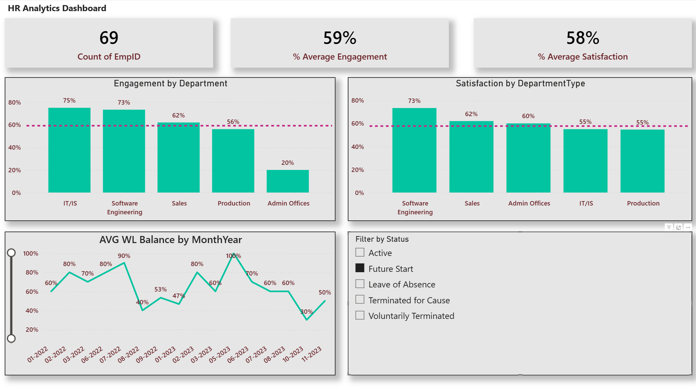

# HR Analytics: Employee Retention & Satisfaction Dashboard

## Project Overview
Аналіз факторів задоволеності персоналу та виявлення причин плинності кадрів на основі даних про 300+ співробітників.

## Key Insights
* **Департаменти з ризиком:** Виявлено критично низький рівень задоволеності у відділі "Admin Offices".
* **Причини звільнень:** Встановлено кореляцію між низьким Performance Score та ймовірністю звільнення.
* **Сегментація:** Аналіз задоволеності в розрізі стажу, статі та посад.

## Skills Demonstrated
* **Power Query:** Очищення та трансформація даних (ETL).
* **DAX:** Створення розрахункових метрик (Measures) та обчислювальних стовпців.
* **Data Modeling:** Створення зв'язків між таблицями.
* **Data Visualization:** Побудова інтерактивного дашборду.

## Preview

## How to use
Ви можете завантажити файл `HR_Analytics_Dashboard.pbix` з цього репозиторію та відкрити його в Power BI Desktop для детального ознайомлення з моделлю даних.
